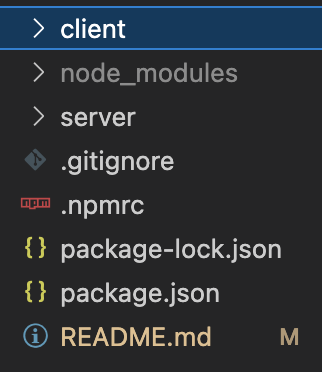
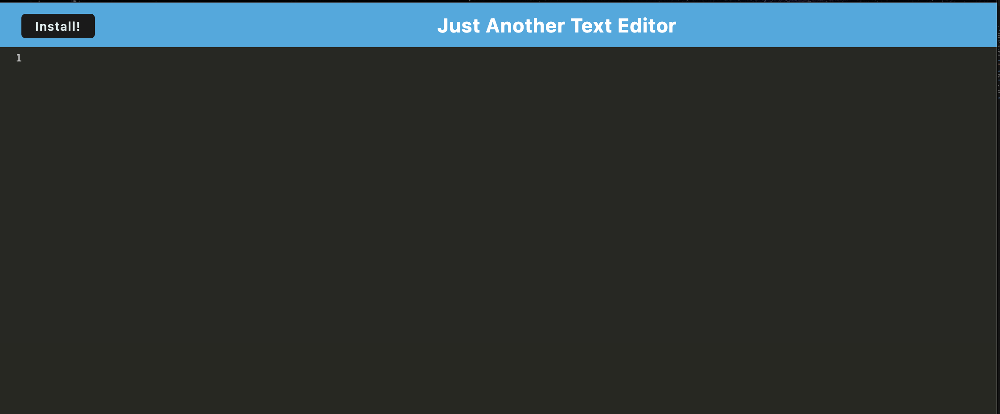

# PWA-JATE - Just Another Text Editor

**What does this application do and why?**

* This application allows you to write and store text with javascript highlighting, which is great for practicing or copying code
* This application can be downloaded to one's desktop to access on or offline

**How the application is organized**
The PWA-JATE app is organized in the following files:

**Step-by-Step on how to run the application**
* Enter the app by going to the deployed heroku url
* Begin typing
* Install by pressing the "Install" button or the button to the right of the ur 

**What the application looks like**

**Link to deployed version of Chandler's Portfolio**

Deployed Heroku App: https://boiling-depths-55371.herokuapp.com/
GitHub Repository: https://github.com/echandlerdavis/PWA-JATE

**Technologies Used** 

* Express
* Express routing
* javascript
* webpack
* IndexDB

